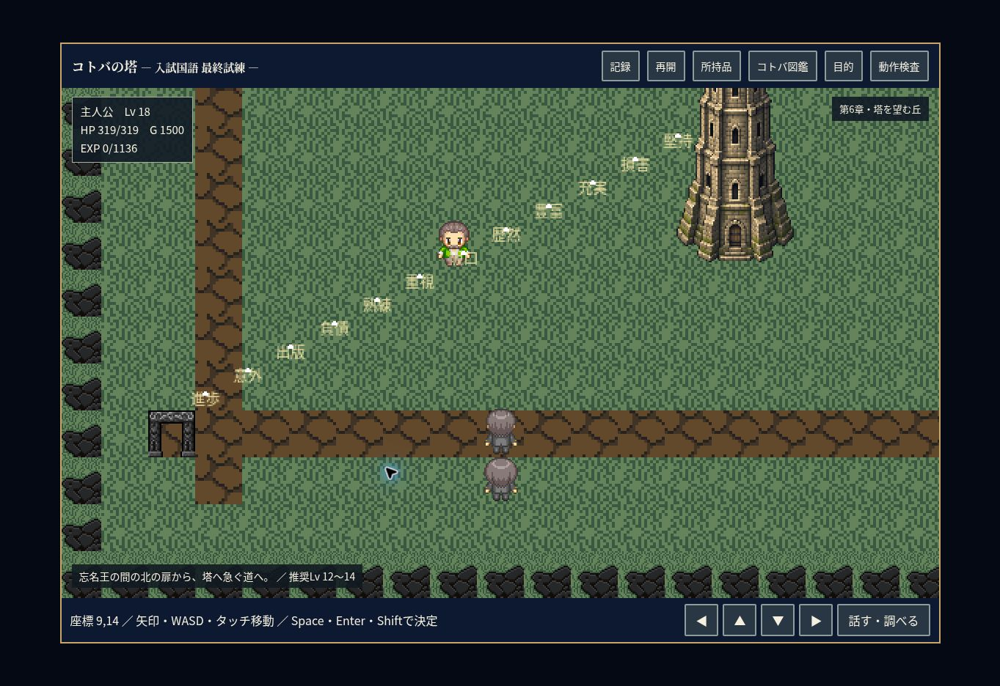
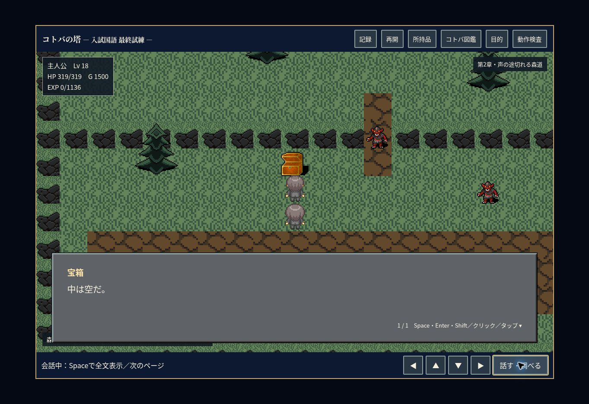

# 0.14.1 修正・検証

塔へ吸い込まれる文字は、除外・訂正を反映した類義語／対義語問題の見出しと正答から435語の二字熟語を抽出。飛行開始ごとに3%で釜渕・阪口・岸・柿本・小川・西村・森本のいずれかを均等抽選。飛行中は文字を固定。見た目用の乱数は戦闘用乱数に影響しない。

全22宝箱の表示矩形・衝突矩形・隣接調査地点を検証。第2章街道と第3章への道の宝箱2つを(9,9)の壁から(9,10)の床へ移設。ID・報酬・旧セーブの開封状態を保持。旧記録の主人公が新しい箱の位置に立っている場合は、隣の安全な床へ補正してロードする。マップ作成ツールも修正。

生存中の戦闘時計は解答・解説表示中のみ停止。正誤判定後の解答表示を即時化し、ボス会話・演出中、入力中、薬の使用時、別タブからの復帰時も経過時間を反映。正解後は残量を引き継ぐ。敵撃破・プレイヤー敗北・報酬画面では戦闘が終了するので追加攻撃なし。ボス会話中の敗北は会話・演出を終了して安全に復帰する。

状態テスト254項目、実HTML・ネイティブCanvasの23テスト群が通過。PC／380px表示、二字熟語の実描画、空箱、背景タブ復帰、旧JSON、第1部エンディング、AFTER STORY、第9章を検証。実機Chromebook全機種での確認は未実施。

セーブ形式・保存キー・問題・シナリオ・装備数値・既存素材を保持。旧版ソースZIPは削除しない。次の本編実装は工程⑤（SCENE69～70）。

公開Chromeでも0.14.1の起動・旧JSON読込・二字熟語と阪口の小ネタ・両方の空箱調査を確認。戦闘の時間切れで同じ問題のままHP319→232、誤答で232→145、解説中の残量0.16374固定、次問・薬使用中の進行、正解で敵HP1280→1081と残量維持を確認。ゲーム由来のコンソールエラー0件。

